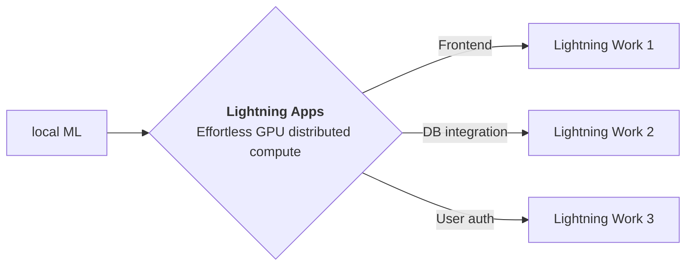

<div style="height: 90pt;"></div>
<div style="flex: 0 0 16%; margin-top: -10pt;">

</div>
<div style="flex: 0 0 65%; text-align: center;">
<h1 style="margin-bottom: 10pt;">Demo: DALLE Mini Research Poster</h1>
<h2>A demo of Dalle Mini using Lightning App</h2>
</div>
<div style="flex: 1">
    <div style="display: flex; align-items: center;">
        
        <div style="font-size: 0.9rem; margin-right: 5pt;"><a href="https://github.com/borisdayma">borisdayma</a></div>
    </div>
    <div style="display: flex; align-items: center;">
        
        <div style="font-size: 0.9rem;"><a href="https://twitter.com/borisdayma">@borisdayma</a></div>
    </div>
</div>

--split--

# DALLE Mini - Generate images from a text prompt

## History

OpenAI had the first impressive model for generating images with DALLE Mini is an attempt at reproducing those
results with an open-source model.


> This app is a demo
> of [Lightning Research Template app](https://github.com/Lightning-AI/lightning-template-research-app) which allows
> authors to build an app to share their everything
> related to their work at a single place.
> Explore the tabs at the top of this app to view blog, paper, training logs and model demo.

> You can fork this app and edit to customize according to your need.

### The simple explanation

The model is trained by looking at millions of images from the internet with their associated captions. Over time, it
learns how to draw an image from a text prompt.
Some of the concepts are learnt from memory as it may have seen similar images. However, it can also learn how to create
unique images that don't exist such as "the Eiffel tower is landing on the moon" by combining multiple concepts
together.
Several models are combined together to achieve these results:
an image encoder that turns raw images into a sequence of numbers with its associated decoder
a model that turns a text prompt into an encoded image
a model that judges the quality of the images generated for better filtering

Credits to [Boris Dayma](https://twitter.com/borisdayma) for this awesome
work [Dalle Mini](https://wandb.ai/dalle-mini/dalle-mini/reports/DALL-E-mini-Generate-images-from-any-text-prompt--VmlldzoyMDE4NDAy)
and [Brett Kuprel](https://github.com/kuprel) for [min-dalle](https://github.com/kuprel/min-dalle).

### Running the App

Once you have installed the app, you can goto the `LAI-dalle-mini-poster-App` folder and
run `lightning run app app.py --cloud` from terminal.
This will launch the template app in your default browser with tabs containing research paper, blog, Training
logs, and Model Demo.

You can control the number of generated images using `OUTPUT_IMAGES` environment variable. To generate 4 images you can
do `lightning run app app.py --env OUTPUT_IMAGES=4 --cloud`

--split--

# Lightning Apps

## Lightning Apps can be built for any AI use case, including AI research, fault-tolerant production-ready pipelines, and everything in between.

!!! abstract "Key Features"

    - **Easy to use-** Lightning apps follow the Lightning philosophy- easy to read, modular, intuitive, pythonic and highly composable interface that allows you to focus on what's important for you, and automate the rest.
    - **Easy to scale**- Lightning provides a common experience locally and in the cloud. The Lightning.ai cloud platform abstracts the infrastructure, so you can run your apps at any scale. The modular and composable framework allows for simpler testing and debugging.
    - **Leverage the power of the community-** Lightning.ai offers a variety of apps for any use case you can use as is or build upon. By following the best MLOps practices provided through the apps and documentation you can deploy state-of-the-art ML applications in days, not months.



### Available at : `Lightning-AI/lightning-template-research-app/app.py`

```python
import lightning as L

poster_dir = "resources"
blog = "https://wandb.ai/dalle-mini/dalle-mini/reports/DALL-E-Mini-Explained-with-Demo--Vmlldzo4NjIxODA"
github = "https://github.com/borisdayma/dalle-mini"
wandb = "https://wandb.ai/dalle-mini/dalle-mini/reports/DALL-E-Mega-Training-Journal--VmlldzoxODMxMDI2"
tabs = ["Poster", "Blog", "Notebook Viewer", "Training Logs", "Demo: Generate images from a text prompt"]

app = L.LightningApp(
    ResearchApp(
        poster_dir=poster_dir,
        blog=blog,
        training_log_url=wandb,
        notebook_path="resources/DALL·E_mini_Inference_pipeline.ipynb",
        launch_gradio=True,
        tab_order=tabs,
        launch_jupyter_lab=False,  # don't launch for public app, can expose to security vulnerability
    )
)

```

### Citation

```bibtex

@article{YourName,
  title={Your Title},
  author={Your team},
  journal={Location},
  year={Year}
}

```
